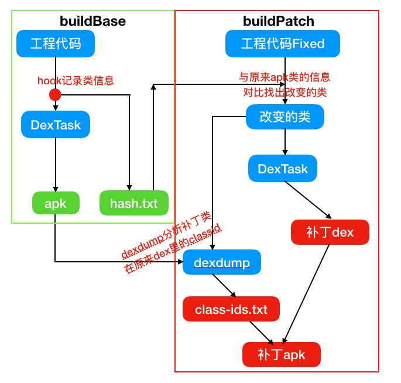

# Android热修复:Qfix方案的gradle实践

## Android热修复方案的发展

Android热修复技术现在主流分为NativeHook,ClassLoader以及新出现的Instant-Run方案，在工作中因为团队需要为团队引入了[QZone的ClassLoader插桩方案](),当初开发的时候(15年底)市面上还只有AndFix和ClassLoader两种方案，而那时的AndFix兼容性也还比较差，就选择了ClassLoader方案，基于网上开源的Nuwa方案而来。

2016年的时候Android热修复方案如雨后春笋，ClassLoader方案新起之秀有Tinker,QFix等。对比几种新出的方案，调研之后认为QFix与团队之前使用的ClassLoader方案最为接近，同时无需插桩，避免了插桩性能损失问题，在16年下半年时候将团队的热修复方案升级到了QFix方案。

由于团队的热修复方案需要对原来的方案做不少兼容，所以会有不少雍余的代码。17年年初就想着自己写个QFix的开源gradle实现，现项目已完成发布到Github,地址：[https://github.com/alexclin0188/QFixPatch](https://github.com/alexclin0188/QFixPatch)。 这篇文章主要是对开发过程的一个记录，发出来供有兴趣的同学参考和自己以后复习使用。

## QFix方案原理

[QFix方案原理介绍原文]()。有兴趣的同学可以仔细研读下这篇原理介绍，这里就不再详细讲解，补丁的基本原来和ClassLoader类同，反射在DexPahList类中dex数组前插入补丁dex，区别在于QFix使用在native层调用dvmResolveClass方法来解决pre-verify的问题。

GitHub上有一个开源的简单的QFix方案Eclipse工程demo:[https://github.com/lizhangqu/QFix](https://github.com/lizhangqu/QFix)

## Gradle插件开发

gradle插件生成补丁逻辑和Nuwa类似，只是增加了dexdump分析补丁类class-id的操作，简单的流程示意图如下：

首先是buildBase，构建基础apk和保存基础信息，在dexTask之前增加hook，将原始apk中的类的sha值保存到hash.txt中，以便生成补丁时使用。

## 补丁应用代码开发